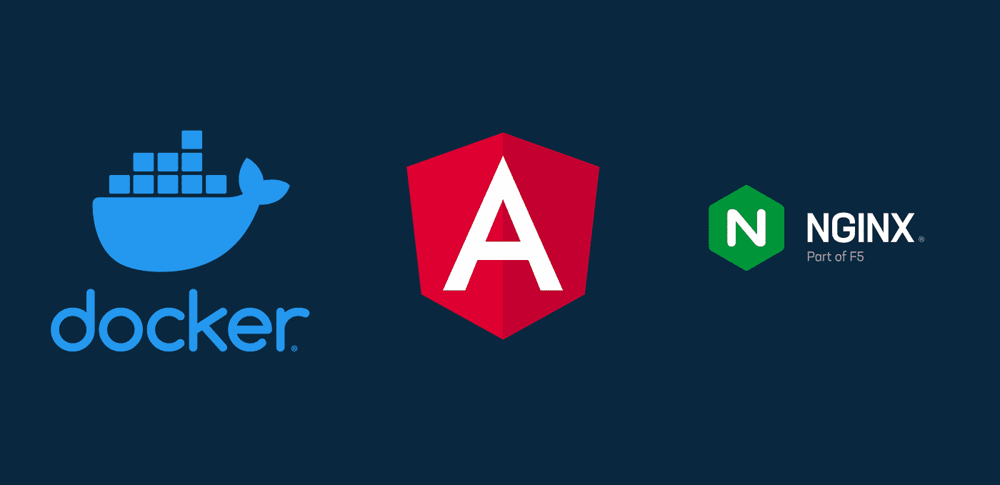

# Despliegue del Frontend de Smart Shell

Repositorio con el código fuente y los scripts necesarios para el despliegue de la Aplicacion Web del proyecto Smart Shell.

## Características
- Modelado e implemantacion de interfaces con HTML, CSS y TailwindCSS.
- Ligth/Dark Mode con TailwindCSS.
- Gestión de sesiones de usuarios con JWT e interceptores de peticiones.
- Routing y Navegación con Angular Router.
- Formularios reactivos y validaciones con Angular Forms.
- Consumo de servicios REST con HttpClient.
- Paginacion y filtros de datos con Angular CDK y RxJS.
- Patrón de diseño de módulos y lazy loading.
- Configuracion con Nginx para el despliegue en producción.
- Automatización del despliegue con Docker y Docker-Compose.

## Repositorios Relacionados

### Repositorio Actual
- [Smart-Shell-Angular](https://github.com/luis122448/smart-shell-angular)

### Repositorios Relacionados

Repositorio referido al BACKEND de la aplicación.
- [Smart-Shell-SpringBoot](https://github.com/luis122448/smart-shell-springboot)

Repositorio relacionado con la automatización del despliegue de las Bases de Datos.
- [Smart-Shell-Bash](https://github.com/luis122448/smart-shell-bash)

Repositorios relacionados con las bases de datos del proyecto.
- [Smart-Shell-Postgres](https://github.com/luis122448/smart-shell-postgres)
- [Smart-Shell-Mongo](https://github.com/luis122448/smart-shell-mongo)
- [Smart-Shell-Redis](https://github.com/luis122448/smart-shell-redis)

## Configuración del Entorno

1. **Clonar el Repositorio**
    ```bash
        git clone https://github.com/luis122448/smart-shell-angular.git
    ```

2. **Ingresar al directorio del proyecto**

    ```bash
        cd smart-shell-springboot
    ```

3. **Ejecutar el script de instalación**
  
    ```bash
        sudo bash dev-install.sh
    ```

## Despliegue en Producción

Para el despliegue en producción se ha utilizado Docker y Docker Compose, puede revisar el archivo docker-compose.yml para conocer los detalles de la configuración.
Asimismo no se olvide de modificar las variables de entono, en asi archivo .env

1. **Ejecutar el script de despliegue**
  
    ```bash
        sudo bash deploy.sh
    ```

## Contribuciones
Las contribuciones son bienvenidas. Siéntete libre de mejorar este proyecto, agregar nuevas características o corregir problemas identificados. Para contribuir, crea un Pull Request o abre un Issue.

## Licencia
Este proyecto está bajo la licencia MIT License.
