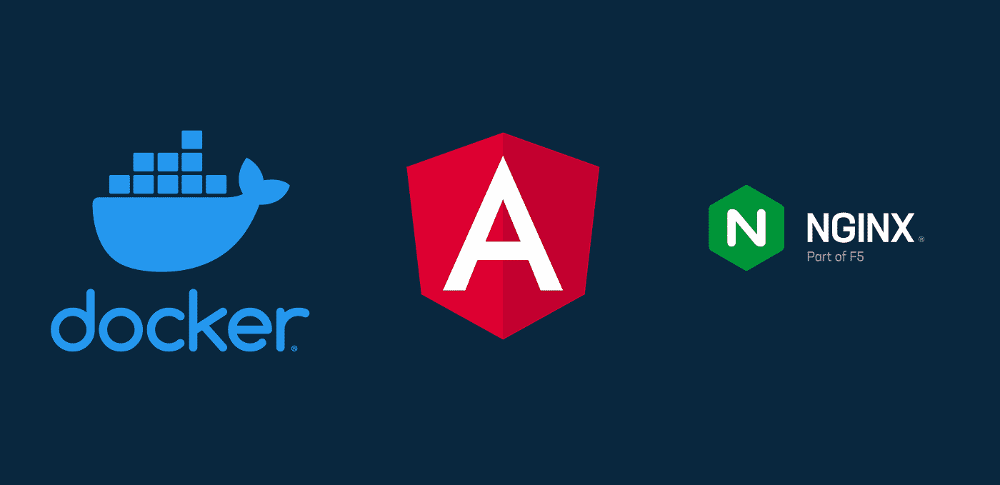

# Despliegue del Frontend de Platform Training

Repositorio con el código fuente y los scripts necesarios para el despliegue de la Aplicacion Web del proyecto Platform Training.

## Características
- Modelado e implemantacion de interfaces con HTML, CSS y TailwindCSS.
- Routing y Navegación con Angular Router.
- Soporte de comentarios personalizados (markdown) con ngx-markdown
- Soporte video y audio con ngx-embed-video y ngx-audio-player.
- Consumo de servicios REST con HttpClient.
- Patrón de diseño de módulos y lazy loading.
- Configuracion con Nginx para el despliegue en producción.
- Automatización del despliegue con Docker y Docker-Compose.

## Repositorios Relacionados

### Repositorio Actual
- [Platform-Training-Angular](https://github.com/luis122448/platform-training-angular)

### Repositorios Relacionados

Repositorio referido al BACKEND de la aplicación.
- [Platform-Training-SpringBoot](https://github.com/luis122448/platform-training-springboot)

## Configuración del Entorno

1. **Clonar el Repositorio**
    ```bash
        git clone https://github.com/luis122448/platform-training-angular.git
    ```

2. **Ingresar al directorio del proyecto**

    ```bash
        cd platform-training-springboot
    ```

3. **Ejecutar el script de instalación**
  
    ```bash
        sudo bash dev-install.sh
    ```

## Despliegue en Producción

Para el despliegue en producción se ha utilizado Docker y Docker Compose, puede revisar el archivo docker-compose.yml para conocer los detalles de la configuración.
Asimismo no se olvide de modificar las variables de entono, en asi archivo .env

1. **Ejecutar el script de despliegue**
  
    ```bash
        sudo bash deploy.sh
    ```

## Contribuciones
Las contribuciones son bienvenidas. Siéntete libre de mejorar este proyecto, agregar nuevas características o corregir problemas identificados. Para contribuir, crea un Pull Request o abre un Issue.

## Licencia
Este proyecto está bajo la licencia MIT License.
